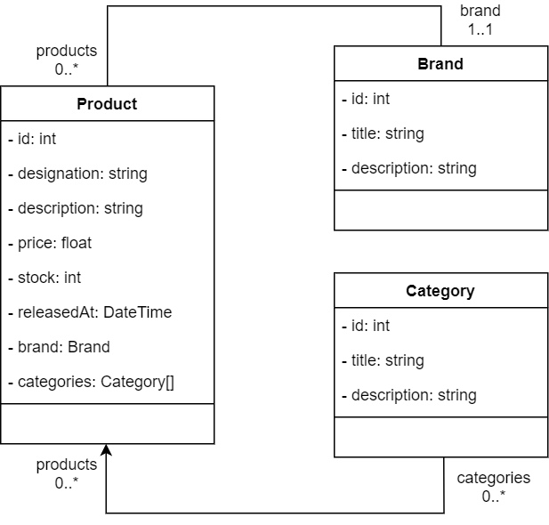
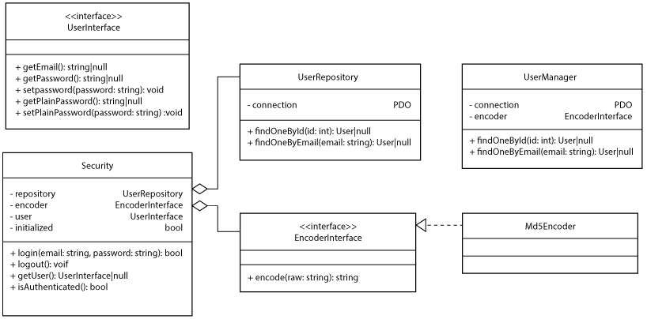

ekyna-learn/php-oo-admin
===

Créer une base de données MySql et importer le fichier __./doc/database.sql__.

# Administration du catalogue

## 1. Développer la gestion des marques

| Fichier | Contenu |
| --- | --- |
| brand/index.php | Liste des marques |
| brand/create.php | Formulaire de création d'une marque |
| brand/read.php | Détail d'une marque |
| brand/update.php | Formulaire de modification d'une marque |
| brand/delete.php | Formulaire de confirmation de suppression d'une marque |

## 2. Développer la gestion des catégories 

Même structure de fichiers que pour les marques.

## 3. Développer la gestion des produits

Même structure de fichiers que pour les marques.

# Sécurisation

